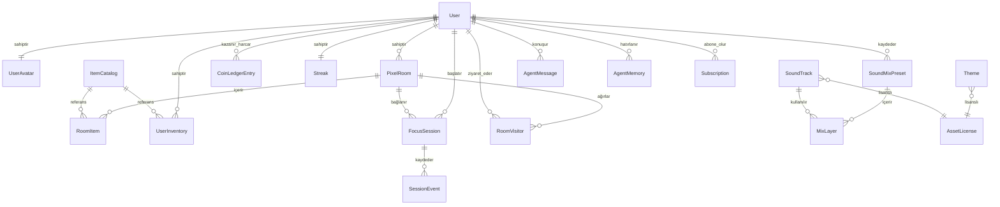

# Veri Modeli (docs/veri-modeli.md)

> Habbo tarzı piksel ev, avatar, envanter, oda eşyaları, oturumlar ve seviye ekonomisi için PostgreSQL kavramsal varlık modeli.
> Tüm kimlikler `uuid` (v7, zamana göre sıralı), tüm zamanlar `timestamptz` (UTC).

---

## 1. İlişki Diyagramı (ERD)

---

## 2. Varlık Tanımları ve Tablolar

### 2.1 Kullanıcı ve Karakter (Avatar)
| Varlık | Alanlar | Kurallar & Açıklama |
| :--- | :--- | :--- |
| `User` | `Id`, `DisplayName`, `Email?`, `IsGuest`, `Level`, `CurrentXp`, `Locale`, `TimeZoneId`, `CreatedAt`, `DeletedAt?` | Misafir hesaplarda e-posta boştur. Seviye ve XP burada tutulur. |
| `UserAvatar` | `UserId`, `SkinTone`, `HairStyle`, `HairColor`, `TopItemCatalogId?`, `BottomItemCatalogId?`, `HatItemCatalogId?`, `GlassesItemCatalogId?`, `ShoesItemCatalogId?` | Kullanıcının giydiği aktif piksel kıyafetleri ve fiziksel özellikleri. |
| `UserPreferences` | `UserId`, `DefaultFocusMinutes`, `ShortBreakMinutes`, `FlowShieldEnabled`, `WeatherSyncEnabled`, `CityKey?`, `AgentEnabled` | Kullanıcı çalışma ayarları. |
| `Streak` | `UserId`, `CurrentDays`, `LongestDays`, `LastActiveDate`, `FreezesAvailable` | Günlük seri takibi ve seri dondurucu hakları. |

### 2.2 Piksel Oda ve Eşya Yerleşimi
| Varlık | Alanlar | Kurallar & Açıklama |
| :--- | :--- | :--- |
| `PixelRoom` | `Id`, `OwnerUserId`, `Name`, `RoomType` (`Studio`, `Loft`, `Penthouse`), `WallPaperCatalogId?`, `FloorCatalogId?`, `IsPublic`, `InviteCode?`, `MaxVisitors` | Kullanıcının piksel evi. Çatı katı (Loft) Pro veya yüksek seviyede açılır. |
| `RoomItem` | `Id`, `RoomId`, `CatalogItemId`, `GridX`, `GridY`, `Rotation` (0, 90, 180, 270), `PlacedAt` | Odadaki izometrik ızgaraya yerleştirilen mobilya (masa, sandalye, lamba, bitki). |
| `RoomVisitor` | `RoomId`, `UserId`, `Status` (`Focusing`, `Break`, `Idle`), `JoinedAt`, `LeftAt?` | Odada o an birlikte çalışan arkadaşların canlı varlık kaydı (ayrıca Redis'te). |

### 2.3 Mağaza ve Envanter Ekonomisi
| Varlık | Alanlar | Kurallar & Açıklama |
| :--- | :--- | :--- |
| `ItemCatalog` | `Id`, `Name`, `Category` (`Desk`, `Chair`, `Furniture`, `Clothing`, `Accessory`, `Wallpaper`, `Floor`), `Tier` (`Free`, `LevelLocked`, `ProOnly`), `RequiredLevel`, `CoinPrice`, `SpriteUrl`, `IsInteractive` | Oyundaki tüm mobilya ve kıyafetlerin ana kataloğu. |
| `UserInventory` | `Id`, `UserId`, `CatalogItemId`, `AcquiredAt` | Kullanıcının satın aldığı veya seviye ödülüyle kazandığı eşyalar. |
| `CoinLedgerEntry` | `Id`, `UserId`, `SessionId?`, `Reason` (`SessionReward`, `BreakBonus`, `ItemPurchase`, `StreakReward`), `Coins`, `CreatedAt` | **Yalnızca ekleme yapılan** muhasebe defteri. Bakiye = toplam. |

### 2.4 Odaklanma Oturumu (Focus Session)
| Varlık | Alanlar | Kurallar & Açıklama |
| :--- | :--- | :--- |
| `FocusSession` | `Id`, `UserId`, `RoomId?`, `Kind` (`Focus`, `ShortBreak`), `Status` (`Running`, `Paused`, `Completed`, `Abandoned`), `PlannedMinutes`, `StartedAt`, `PlannedEndAt`, `EndedAt?`, `NetFocusSeconds`, `ExtensionCount`, `XpEarned`, `CoinsEarned`, `ThemeId?`, `MixPresetId?` | Masaya oturulduğunda başlatılan seans. |
| `SessionEvent` | `Id`, `SessionId`, `Type` (`Started`, `Paused`, `Resumed`, `Extended`, `Completed`, `Abandoned`), `At` | Net süre ve hile kontrolü için zaman damgaları. |

### 2.5 Ses, Görsel ve Lisans
| Varlık | Alanlar | Kurallar & Açıklama |
| :--- | :--- | :--- |
| `Theme` | `Id`, `Name`, `Category`, `VideoFiles` (jsonb), `PosterUrl`, `Palette` (jsonb), `WeatherTags[]`, `LicenseId`, `IsPublished` | Arka plan penceresi ve görsel atmosfer. |
| `SoundTrack` | `Id`, `Title`, `Layer` (`Music`, `Ambience`, `Noise`, `Texture`), `DurationSeconds`, `Files` (jsonb), `LicenseId` | Plak çalardan veya mikserden çalan sesler. |
| `AssetLicense` | `Id`, `SourceName`, `LicenseType` (`CC0`, `CCBY`, `Pixabay`, `Owned`), `LicenseUrl`, `Author?`, `AttributionText?` | Hukuki güvence tablosu (`NC`/`ND` kabul edilmez). |

### 2.6 Ajan ve Abonelik
| Varlık | Alanlar | Kurallar & Açıklama |
| :--- | :--- | :--- |
| `AgentMemory` | `UserId`, `Fact`, `Embedding` (`vector(768)`), `CreatedAt`, `LastUsedAt` | Odadaki retro terminalin kullanıcı hakkında hatırladığı gerçekler. |
| `Subscription` | `UserId`, `Provider`, `ProviderSubscriptionId`, `Plan`, `Status`, `CurrentPeriodEnd` | Pro üyelik durumu. |
